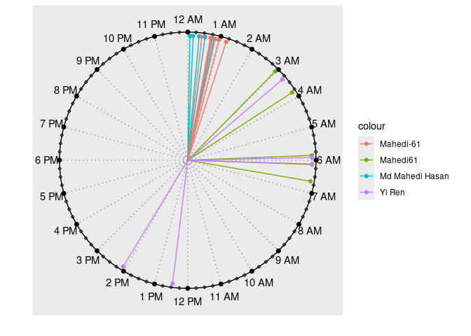

<!-- README.md is generated from README.Rmd. Please edit that file -->

# getcommit

<!-- badges: start -->

<!-- badges: end -->

The goal of **getcommit** is to provide a simple interface for
retrieving commit history from GitHub repositories and analyzing
developer activity over time.

With **getcommit**, you can:  
- Fetch recent commits from any public GitHub repository.  
- Filter commits by branch, date range, or number of commits.  
- Export commit history to a tidy data frame or CSV.  
- Visualize commit activity (e.g., by date, author, or time of day) in
R.

## Installation

You can install the development version of getcommit from
[GitHub](https://github.com/) with:

``` r
# install.packages("pak")
pak::pak("mahmudstat/getcommit")
```

## Examples

Let us see some commits from the `dplyr` package of the `tidyverse`
ecosystem.

``` r
library(getcommit)
comm <- get_commits("tidyverse/dplyr", n = 30, from = "2024-05-15", to = "2025-09-02")
head(comm[-1])
#> # A tibble: 6 × 3
#>   author         date                message                                   
#>   <chr>          <dttm>              <chr>                                     
#> 1 Davis Vaughan  2025-07-25 13:22:14 Use finalized `format-suggest.yaml`       
#> 2 Davis Vaughan  2025-07-23 20:01:50 Switch to updated `format-suggest.yaml`   
#> 3 Davis Vaughan  2025-07-23 19:54:08 Add current `format-suggest.yaml` workflow
#> 4 Davis Vaughan  2025-07-23 19:53:14 Format with Air 0.7.0                     
#> 5 Hadley Wickham 2025-05-30 15:43:14 Add kapa ai to navbar (#7684)             
#> 6 Davis Vaughan  2025-03-03 19:42:02 `use_air()`
```

## Viewing the commits on the clockplot

``` r
library(clockplot)
library(dplyr)
#> 
#> Attaching package: 'dplyr'
#> The following objects are masked from 'package:stats':
#> 
#>     filter, lag
#> The following objects are masked from 'package:base':
#> 
#>     intersect, setdiff, setequal, union
library(hms)
comm <- comm %>%
  mutate(hms = hms::as_hms(date))
# Step 2: Plot with clockplot
clock_chart_qlt(
  comm,
  time = hms,
  crit = author
)
#> Warning in clock_chart_qlt(comm, time = hms, crit = author): No. of categories
#> is more than 5 and may not be distinguished well. Try clock_chart() function
#> instead?
```


